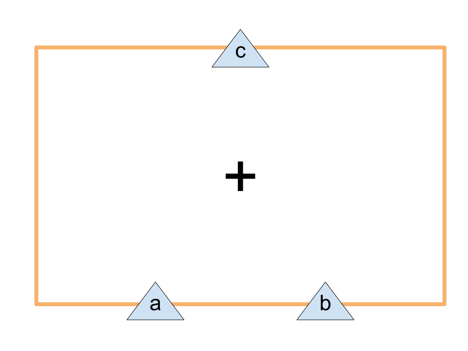
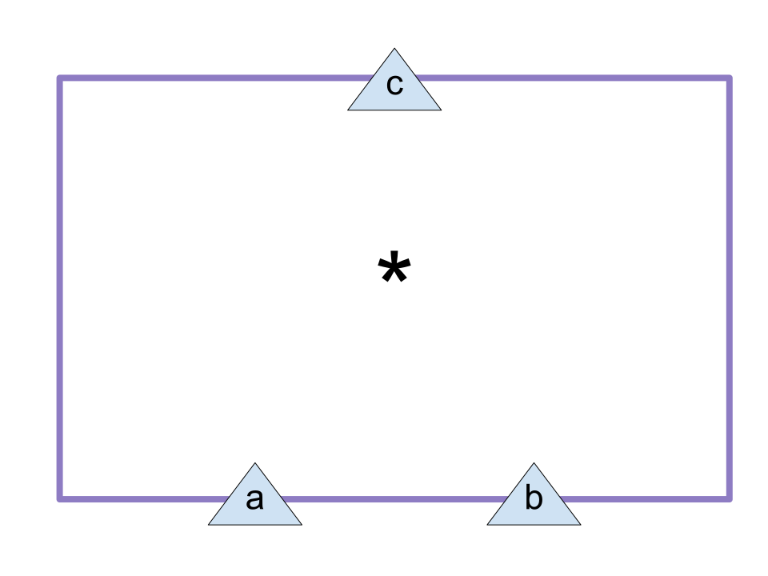

# Module Structure Language
Module Structure Language (MSL) is a YAML based language to describe the internal structures of modules.

In the context of this document and the entire of this repository, "module" means a program which takes some series of data in some definite format as input, and processes them to output some data in another format.
Even manual works are also regarded as special "modules," as long as the formats of input and output data are defined.

## Module Structure Diagram
So, what's the "internal structure" of a module?
Sometimes, a module consists of some "submodules."

For example, let's consider a simple module `M` which calculates the total value to pay when we buy some pencils and erasers.
Apparently, `M` needs to know the prices of a pencil and an eraser.
Let us give some "nicknames" on them, such as `x` and `y`, respectively.
In addition, `M` takes the data of the numbers of pencils and erasers, denoted by `m`, `n` respectively, as input.
As a result of some internal processing, `M` outputs a single integer, which we may call `z`.

OK, now we can draw the "Module Structure Diagram (MSD)" of `M`, as shown below:


Where, `+` and `*` represents the "primitive" modules, the modules which have no internal structures (or which we don't need to consider them).
Module `+` takes two integers as input data, and outputs the sum of the two integers.
Now the reader may easily guess the function of another module `*`.

The diagram above clearly describes the "internal structure" of `M`, namely, how it uses the input data and its "submodules" `+` and `*` to produce the output.

Sometimes, it is also helpful to draw the diagrams of primitive modules.




The reader may wonder why their internal areas are not filled by their colors, unlike in the diagram of `M`.
The reason of this will be clear in the next section.

## Description using a formal language
Diagrams like above figures are easy to understand for humans, but little bit inconvenient to treat for computers, because they are not text data.
Imagine that we have a simple language to describe the structures sketched in the figures above.
Also, imagine that we have a tool which automatically produces the diagrams from documents written in the language.
Sounds awesome, isn't it?

So, let's write down "documents" corresponding to the diagrams above.
As mentioned at the beginning of this document, we choose the YAML format as the base of the language. 

Just for convenience to write in the format of YAML, first we change the names of the submodules used in the example of the previous section.
That is, we'll call the module which used to be called `+` as `Add` from now. Similarly, we'll call the old `*` as `Mult` from now.
Then, definition of these modules may look like as follows:

```yml
name: Add
in:
    a: int
    b: int
out:
    c: int
```

```yml
name: Mult
in:
    a: int
    b: int
out:
    c: int
```

They simply decline the names of modules and the data types of input/output data.
Since these are "primitive" modules, they don't have any directives which express their internal structures.

The definition of `M` would be much more complicated, because it is not a primitive module and thus must include the `structure` directive.

```yml
name: M
in:
  x: int
  y: int
  m: int
  n: int
out:
  z: int
structure:
    submodules:
        -   name: mult1
            class: Mult
            in:
                a: in.m
                b: in.x
        -   name: mult2
            class: Mult
            in:
                a: in.n
                b: in.y
        -   name: add
            class: Add
            in:
                a: mult1.c
                b: mult2.c
    out:
        z: add.c
```

The `structure` directive consists of two directives, namely, `submodules` directive and `out` directive. The value of `submodules` directive is an array of definitions of "module instances."

Rigorously, the things we have called "module definitions" so far are in fact definitions of "module classes."
Roughly speaking, a module class is a "template" of module instances, which we use in other modules as their "components."
In the diagrams in the previous section, filled rectangles represent module instances, and rectangles with white internals represent module classes.

The directives `submodules` and `out` of `structure` directive completely determine the relationships among the input/output data and the submodules of `M`.
