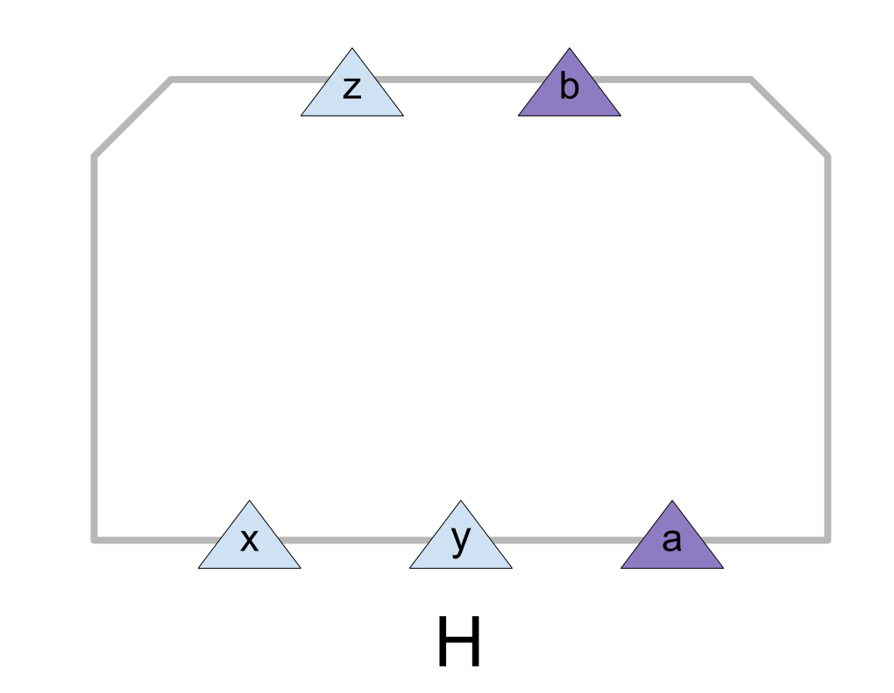
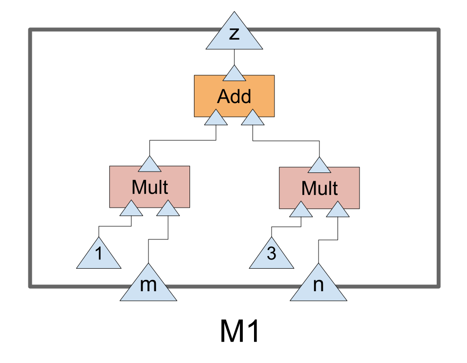
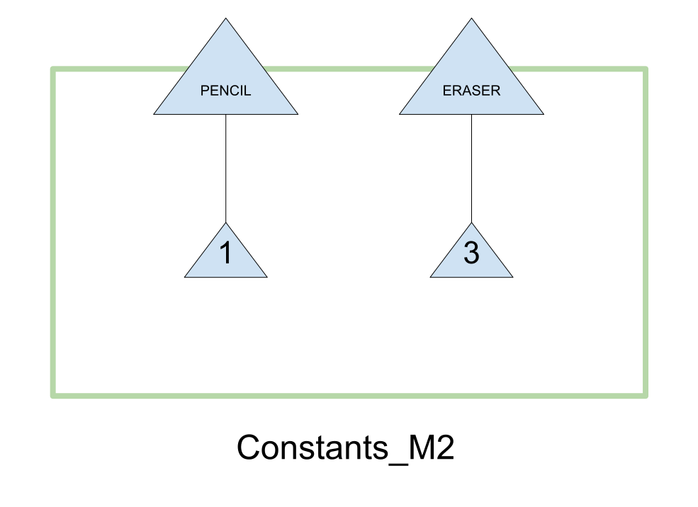
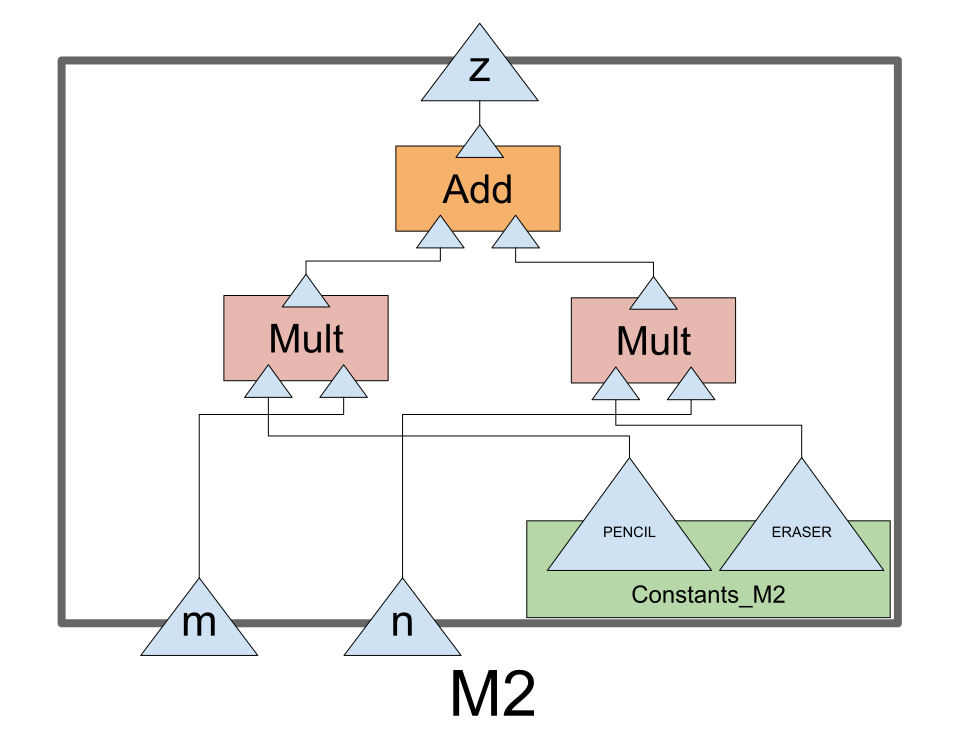
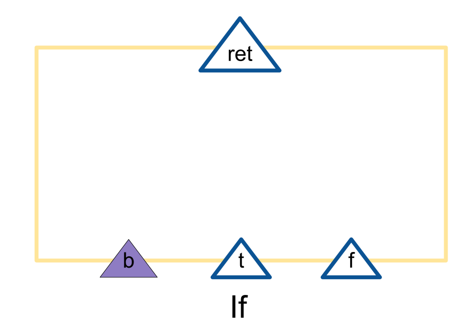
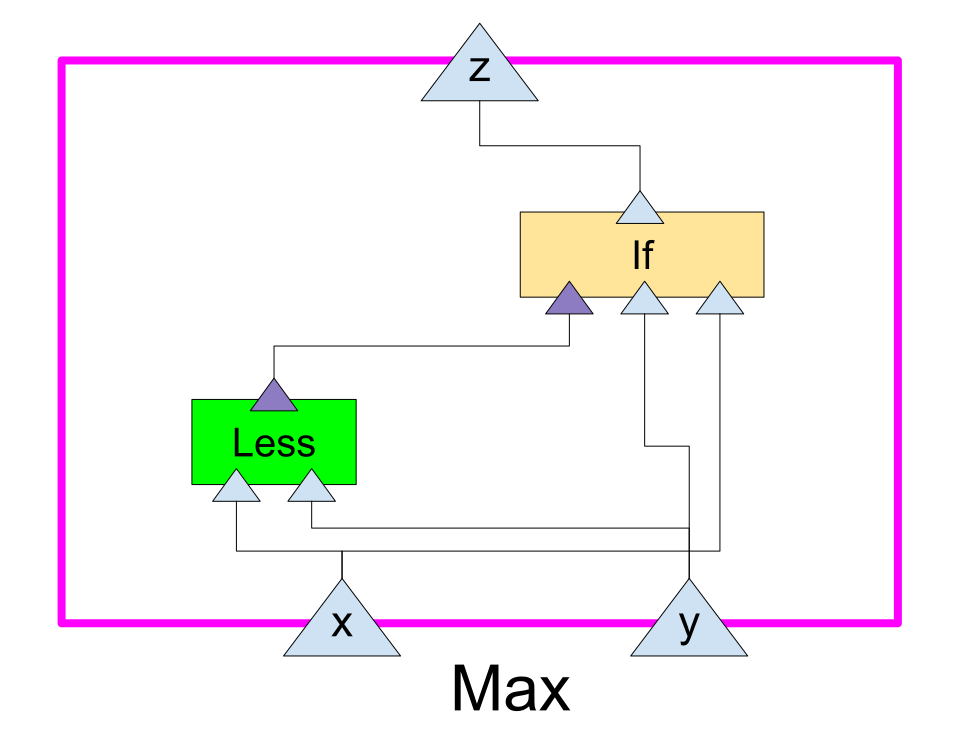

# Module Structure Language
Module Structure Language (MSL) is a YAML based language to describe the internal structures of modules.

In the context of this document and the entire of this repository, "module" means a program which takes some series of data in some definite format as input, and processes them to output some data in another format.
Even manual works are also regarded as special "modules," as long as the formats of input and output data are defined.

# Introduction
## Module Structure Diagram
So, what's the "internal structure" of a module?
Sometimes, a module consists of some "submodules."

For example, let's consider a simple module `M` which calculates the total value to pay when we buy some pencils and erasers.
Apparently, `M` needs to know the prices of a pencil and an eraser.
Let us give some "nicknames" on them, such as `x` and `y`, respectively.
In addition, `M` takes the data of the numbers of pencils and erasers, denoted by `m`, `n` respectively, as input.
As a result of some internal processing, `M` outputs a single integer, which we may call `z`.

OK, now we can draw the "Module Structure Diagram (MSD)" of `M`, as shown below:


Where, `+` and `*` represents the "primitive" modules, the modules which have no internal structures (or which we don't need to consider them).
Module `+` takes two integers as input data, and outputs the sum of the two integers.
Now the reader may easily guess the function of another module `*`.

The diagram above clearly describes the "internal structure" of `M`, namely, how it uses the input data and its "submodules" `+` and `*` to produce the output.

The triangles placed at the bottom of the rectangles are called "input nodes," whereas the triangles at the top of them are called "output nodes."
Generally, a module may have multiple output nodes, although it's not the case in the above example.
Of course, every module must have at least one output node.
On the other hand, it is possible that some modules don't have any input nodes.

Polygonal lines which connect output nodes and input nodes of modules are called "links."
A link denotes "feeding" the output of the module which is connected at one end of the line to the module at the another end as its input.

Sometimes, it is also helpful to have the diagrams of primitive modules.
Since they have no internal structures, drawing their own input and output nodes is enough.


The reader may wonder why their internal areas are not filled by their colors, unlike in the diagram of `M`.
The reason of this will be clear in the next section.

## Description Using a Formal Language
Diagrams like above figures are easy to understand for humans, but little bit inconvenient to treat for computers, because they are not text data.
Imagine that we have a simple language to describe the structures sketched in the figures above.
Also, imagine that we have a tool which automatically produces the diagrams from documents written in the language.
Sounds awesome, isn't it?

So, let's write down "documents" corresponding to the diagrams above.
As mentioned at the beginning of this document, we choose the YAML format as the base of the language. 

Just for convenience to write in the format of YAML, first we change the names of the submodules used in the example of the previous section.
That is, we'll call the module which used to be called `+` as `Add` from now. Similarly, we'll call the old `*` as `Mult` from now.
Then, definition of these modules may look like as follows:

```yml
name: Add
in:
    a: int
    b: int
out:
    c: int
```

```yml
name: Mult
in:
    a: int
    b: int
out:
    c: int
```

They simply decline the names of modules and the data types of input/output data.
Since these are "primitive" modules, they don't have any directives which express their internal structures.

The definition of `M` would be much more complicated, because it is not a primitive module and thus must include the `structure` directive.

```yml
name: M
in:
    x: int
    y: int
    m: int
    n: int
out:
    z: int
structure:
    submodules:
        -   name: mult1
            class: Mult
            in:
                a: in.m
                b: in.x
        -   name: mult2
            class: Mult
            in:
                a: in.n
                b: in.y
        -   name: add
            class: Add
            in:
                a: mult1.c
                b: mult2.c
    out:
        z: add.c
```

The `structure` directive consists of two directives, namely, `submodules` directive and `out` directive. The value of `submodules` directive is an array of definitions of "module instances."

Rigorously, the things we have called "module definitions" so far are in fact definitions of "module classes."
Roughly speaking, a module class is a "template" of module instances, which we use in other modules as their "components."
In the diagrams in the previous section, filled rectangles represent module instances, and rectangles with white internals represent module classes.

The directives `submodules` and `out` of `structure` directive completely determine the relationships among the input/output data and the submodules of `M`.

The keyword `in` has a special meaning in the `submodules` directive.
It's regarded as a name of an "implicit" module instance, which has no input nodes.

Similarly, keyword `out` is also reserved for another "implicit" module instance name in the definition of a module class.
It is treated as a special "module instance" which has no output nodes (that's impossible for "normal" modules, though).

## Basic Rules for MSD
Here is summary of how to draw MSD:
- Module classes are denoted by filled rectangles.
- Module instances are denoted by blank rectangles.
- Module classes are identified by their own colors.
- Input/output nodes of modules are denoted by filled triangles.
- Connect output nodes and input nodes of modules by links to indicate "feeding" the series of output data to the input nodes.

In addition, we have some logical constraints on the drawers:
- Each input node of a module instance must be connected to exactly one output node of another module by a link.
- (On the other hand, an output node of a module instance does not need to be connected to just one input node of some another module by a link. An output node may not be connected to any input node, and may be connected to multiple input nodes of other modules.)

## Definition of Data Types
As well as the case of modules, each data type is also distinguished from each other by its color in MSD.

For example, one may choose sky blue to represent `int`, and purple to represent `bool`.
Then, the drawer should add figures like following as the "definition" of these data types:


For the totally same reason as the case of modules, the data types are denoted by blank triangles in their definition diagrams, but not filled ones.

And in the corresponding MSL document, the definition would be like this:

```yml
-   name: int
-   name: bool
```

They are quite simple because the data types don't have any "internal structures" in this case.
We would see more complicated data types in the future.

## Human as Module
As already stated in the above paragraphs, works carried out by humans can also be regarded as special modules called "human modules."

The definition diagrams of human modules are almost same as the software ones, except that the upper corners of the rectangles are truncated:



Of course, this is a kind of random example.
Optionally, one can add the internal structure of this module to the diagram.

In the form of MSL, a new directive named `type` enters in the definition of the module class:

```yml
name: H
type: Human
in:
    x: int
    y: int
    a: bool
out:
    z: int
    b: bool
```

## Literals and Constants
Sometimes, one may want to define several constants in the definitions of modules to help describing the internal structures of them.

Here, let us return to the previous example of module `M`.
Assume that we know the values of `x` and `y` in advance, say, `1` and `3` for example.
In this case, it is better to treat these quantities as constants in the module, rather than input variables.

The naivest way to treat constants in the module definitions is explicitly including the raw values into them, which are called "literals," just like this:



```yml
name: M1
in:
    n: int
    m: int
out:
    z: int
structure:
    submodules:
        -   name: mult1
            class: Mult
            in:
                a: in.m
                b: 1
        -   name: mult2
            class: Mult
            in:
                a: in.n
                b: 3
        -   name: add
            class: Add
            in:
                a: mult1.c
                b: mult2.c
    out:
        z: add.c
```

where we named the new version of the module class `M1`.

The definition described in above diagram and document is totally valid and includes no logical mistakes, but its manner can never be said very nice.
Good programmers know that it is not a good idea to explicitly include magic values in their program code without defining constants, and it's the same in MSD/MSL.

In our language, the concept of "constants" can be expressed by using "constant modules," which are modules storing the constant values in their internals, and just output the values without any input.
This is easily achieved within the range of standard features of MSD and MSL, without consulting any additional ideas.

First, let's define a module class of the constant module storing the constants for the new version of `M`, which may be denoted by `Constants_M2`.
According to the common custom of programming, we shall use upper case characters for the names of the constants.
Hence, we choose identifiers `PENCIL` and `ERASER` to label them (whose values are `1` and `3`, as we have defined above).



```yml
name: Constants_M2
out:
    PENCIL: int
    ERASER: int
structure:
    out:
        PENCIL: 1
        ERASER: 3
```

With the help of these definitions, the previous MSD and MSL of `M1` would be improved like following:



```yml
name: M2
in:
    n: int
    m: int
out:
    z: int
structure:
    submodules:
        -   name: const
            class: Constants_M2
        -   name: mult1
            class: Mult
            in:
                a: in.m
                b: const.PENCIL
        -   name: mult2
            class: Mult
            in:
                a: in.n
                b: const.ERASER
        -   name: add
            class: Add
            in:
                a: mult1.c
                b: mult2.c
    out:
        z: add.c
```

where we have named the new version of the module class `M2`.
They look much nicer than the previous versions.

In real software systems, the nature of constant modules may often be the contents of some config files.
Although the files themselves do not "output" any data, it's not forbidden to simply regard them as "modules" in our framework.

# More Complicated Examples
At this point, the reader may complain about the too poor ability of expression of the language and diagram.
For example, how should we express conditional branching and loop?
What should we do if we need to describe the internal structures of modules which include recursion?
It is obvious that the basic features which have been presented so far are not enough to work on these complicated logical processes.

## Generic Modules
Let us begin with one of the basic "building blocks" of almost all programming languages, `if` statement.
Of course, in our framework the feature should be realized as a module class as well.

From the point of view of the functional programming, `if` is a function (or an operator) which takes three arguments (which we call `b`, `t`, `f` according to their order):

1. A value of `bool` type to be used to determine which value of the remaining parameters (`t` or `f`) to return.
1. A value to be returned when the function got `true` value as the first argument `b`.
1. Another value for the case when `false` is given.

If one is told to draw the definition diagram of our new module class `If` (as primitive) right now, he/she would produce something like this:



Something is wrong?
To say the judgement first, this is completely the right answer (we have to say that it's a miracle, though).

The biggest problem here seems to be that the data type of two of the three input nodes, namely `t` and `f`, and the output node `ret` (they must be of the same type) is unknown at the moment of module class definition.
It should be determined when the module instances are created from the class, in the definitions of other module classes.
This is not applicable to any type of modules which we have seen.

So, let us borrow the notion of "generic types" from the today's modern programming languages like C++, Java and many other well-known examples.
Let `D` be a "type parameter" of `If`.
To decline that the parameter will be used in the definition, it is natural to introduce a new directive `param` to the top level of the definition statement.
This enables us to define the "generic module" `If(D)` as following:

```yml
name: If
param:
    - D
in:
    b: bool
    t: D
    f: D
out:
    ret: D
```

Surprisingly, this is completely consistent with the above diagram.
The blank triangles with dark blue borders can be thought to denote the type specified by parameter `D` (recall that the blank triangles denote certain types of data, but not pieces of data themselves).
They will be filled by some colors depending on the types given as the parameter, when the module instances are created from the class.

Here is an example of simple module `Max`, which uses `If(int)` as its submodule.



## Abstract Modules
## Higher Order Modules
## Type of Modules
