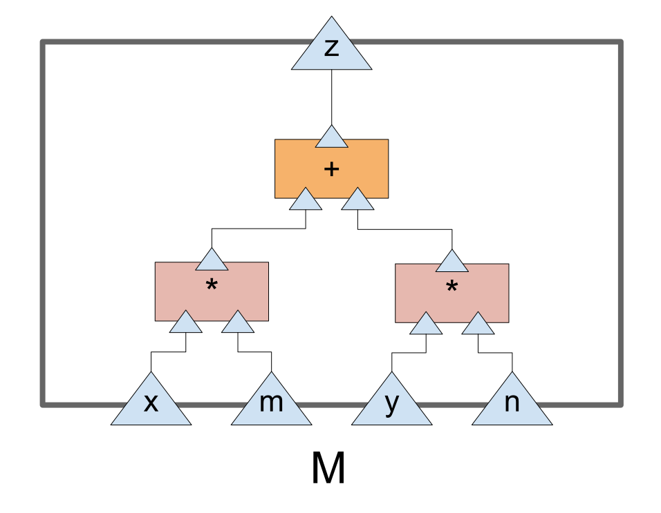

# Module Structure Language
Module Structure Language (MSL) is a YAML based language to describe the internal structures of modules.

In the context of this document and the entire of this repository, "module" means a program which takes some series of data in some definite format as input, and processes them to output some data in another format.
Even manual works are also regarded as special "modules," as long as the formats of input and output data are defined.

# Module Structure Diagram
So, what's the "internal structure" of a module?
Sometimes, a module is consists of some "submodules."

For example, let's consider a simple module `M` which calculates the total value to pay when we buy some pencils and erasers.
Apparently, `M` needs to know the prices of a pencil and an eraser.
Let us give some "nicknames" on them, such as `x` and `y`, respectively.
In addition, `M` takes the data of the numbers of pencils and erasers, denoted by `m`, `n` respectively, as input.
As a result of some internal processing, `M` outputs a single integer, which we may call `z`.

OK, now we can draw the "Module Structure Diagram (MSD)" of `M`, as shown below:

Where, `+` and `*` represents the "primitive" modules, the modules which have no internal structures (or which we don't need to consider them).
Module `+` takes two integers as input data, and outputs the sum of the two integers.
Now the reader may easily guess the function of another module `*`.

The diagram above clearly describes the "internal structure" of `M`, namely, how it uses the input data and its "submodules" `+` and `*` to produce the output.
